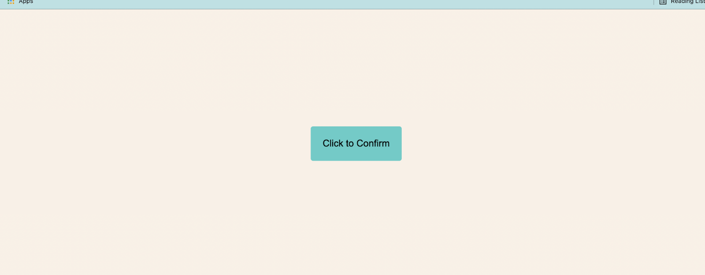
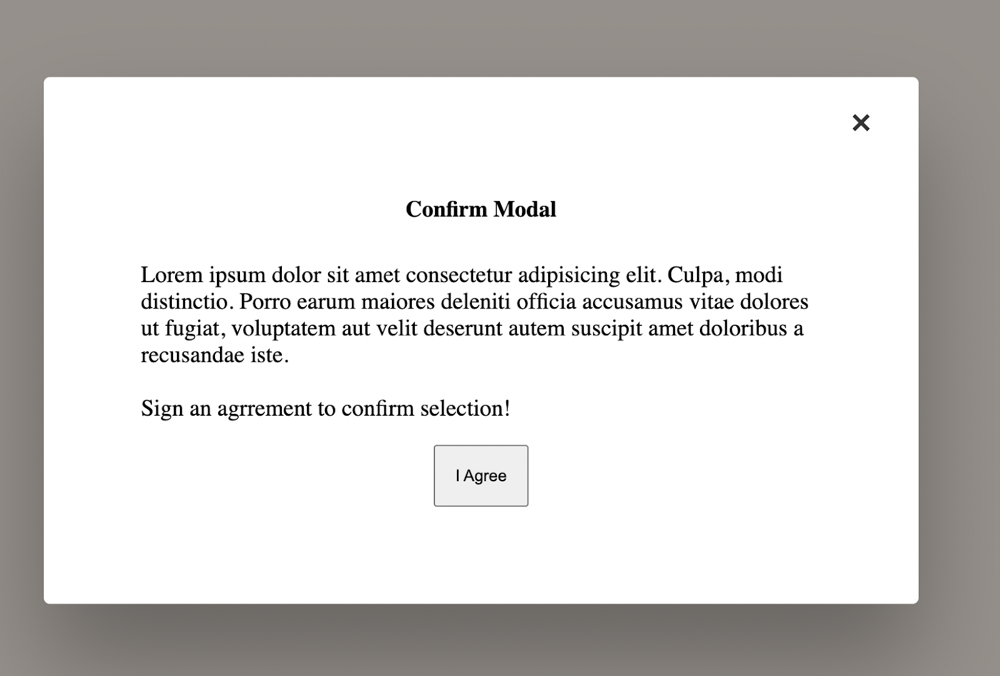

# Confirmation Modal Interview Question

Create a confirmation modal at the click of a button. The following pointers should be covered:

- The button on which the modal will open should be at the center of the web page as shown below:
  
- On click, a modal window should pop up.

### Modal window should have:

- Some text content.
- A close button which on click should close the modal and bring the user back to the normal page. It should be present on the top right corner of the modal.
- The confirmation (I Agree) button on click should close the modal and bring the user back to the normal page. This button must be at the bottom center of the modal.

Sample modal window is shown below:

- When the modal window is present the entire background should overlay (fade away).
